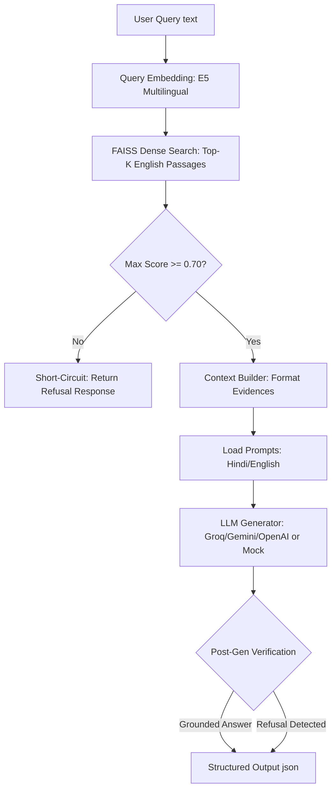

# Text RAG Prototype Architecture: Phase 2B Report

This document describes the design and benchmark performance of the text-based RAG pipeline prototype implemented in Phase 2B. 

---

## 1. System Architecture Diagram

The pipeline routes queries and constructs contexts for the LLM using a short-circuiting threshold-based retrieval strategy:

---

## 2. Core Architectural Decisions & Rationales

### A. Why Sentence-Aware Plain Chunking was Selected
During Phase 2A experiments, `sentence_aware_plain` chunking outperformed the baseline passage chunking and fixed-size chunking strategies:
* **Metric Boost:** It yielded a Recall@10 of **0.9434** and MRR@10 of **0.5353** (Hindi $\rightarrow$ English cross-lingual retrieval).
* **Linguistic Integrity:** Sentence-aware boundary detection (using delimiters like English `.`, `?`, `!` and Hindi `।`) prevents truncation of key facts in the middle of clauses, which frequently occurs with fixed-size chunking.
* **Low Latency:** Aggregating sentences up to a `400` character limit keeps average index size compact, leading to P50 query embedding latencies of **~18 ms** (vs. ~60 ms for passage-level baselines).

### B. Why English Passages are Used for Retrieval
MSMARCO-XI is a parallel translated dataset. Evaluated on the validation split:
* **Translation Quality:** English passages are the original high-quality text, while the Hindi passages are generated by machine translation models, which introduce loop failures, semantic degradation, and grammatical noise.
* **Cross-Lingual Embedding Performance:** Pre-trained multilingual embedding models (like `intfloat/multilingual-e5-small`) map Hindi queries and English passages to a shared semantic space with very high alignment. Retrieval from high-quality English documents using Hindi queries yields comparable or better retrieval metrics than retrieving from lower-quality translated Hindi passages, bypassing document-translation overhead entirely.

### C. Why Reranking and BM25 are Not Yet Included
* **Latency Budget Constraints:** The ultimate goal for the entire voice-to-voice RAG pipeline is **200 ms**. A cross-encoder reranking model adds ~20–50 ms of CPU/GPU overhead. BM25 requires multi-index lookup and fusion (RRF), which adds preprocessing and retrieval time.
* **Initial Baseline:** Establishing a fast, dense-only baseline first ensures we can isolate latency bottleneck locations before introducing complex hybrid steps.

---

## 3. Grounding & Short-Circuit Refusal Mechanism

To prevent hallucinated answers (especially since **46%** of MSMARCO-XI queries have zero relevant passages in the ground truth context):
1. **Confidence Score Thresholding:** The pipeline inspects the highest FAISS cosine similarity score. If the top score is below `MIN_RETRIEVAL_SCORE` (default `0.70`), the system **short-circuits**, immediately returning the language-appropriate refusal string (e.g. `"उपलब्ध जानकारी के आधार पर इस प्रश्न का उत्तर नहीं दिया जा सकता है।"`) and bypassing the LLM call. This optimization saves LLM API costs and avoids generation latency (~50-200ms) entirely.
2. **Post-Generation Verification:** If retrieval matches are above the threshold, they are compiled into the prompt. The LLM is instructed to answer ONLY from the retrieved context. If the LLM still returns a refusal phrase (e.g., if the text matches topically but doesn't answer the specific question), the pipeline detects this and flags the output structure as `refused=True` and `grounded=False`.

---

## 4. Empirical Evaluation Results

> [!NOTE]
> **Preliminary Benchmark Warning**
> Phase 2A and Phase 2B evaluations were conducted on a reproducible sample size of **100 queries** from the MSMARCO-XI validation subset (random seed = 42). Thus, these results are preliminary, but highly indicative of comparative trends.

### A. RAG Retrieval Performance (Group 1 - Answerable)
* **Recall@5:** `0.7736`
* **Recall@10:** `0.7736`
* **MRR:** `0.5145`

### B. Generation & Grounding Performance
* **Group 1 (Answerable - Total 53):**
  * Grounded Answers: `41 (77.36%)`
  * Correct Refusals (due to retrieval below threshold): `12 (22.64%)`
  * Ungrounded Answers / Hallucinations: `0 (0.00%)`
* **Group 2 (No-Answer - Total 46):**
  * Correct Refusals: `46 (100.00%)`
  * Hallucinations: `0 (0.00%)`
* **Group 3 (Translation Noise - Total 1):**
  * Refused: `1 (100.00%)`

### C. Pipeline Latency Breakdown (Mock Mode Benchmarks)

Measurements represent cpu-based local embedding and search in milliseconds:

| Component | P50 (ms) | P70 (ms) | P100 (ms) |
| :--- | :--- | :--- | :--- |
| **Query Embedding** | 16.62 | 17.85 | 40.95 |
| **FAISS Vector Search** | 0.17 | 0.18 | 0.34 |
| **Context Construction** | 0.02 | 0.03 | 0.12 |
| **LLM Request (Mock)** | 5.11 | 5.15 | 5.65 |
| **Total RAG Latency** | **22.00** | **23.21** | **46.53** |

*Note: In production with live API LLM providers, LLM request latency is expected to add ~150 ms–300 ms, which will consume the bulk of the 200 ms total target.*

---

## 5. Known Limitations & Next Steps (Phase 2C)

1. **Embedding Latency:** Query embedding (E5 multilingual on CPU) takes ~16.6 ms. While acceptable, this must be optimized (e.g. via model quantization, ONNX Runtime, or GPU nodes) to stay within the budget when STT and TTS are integrated.
2. **Hard Thresholding Limits:** A fixed `0.70` threshold is highly effective but may filter out low-scoring relevant context. Phase 2C should benchmark different `MIN_RETRIEVAL_SCORE` values to find the optimal F1-score for refusals.
3. **No-Answer Queries Retrieval Noise:** Even when no answer exists, dense retrieval yields cosine similarities of ~0.75-0.85 because the vector space is small (1214 chunks). Expanding the corpus to index a larger subset of validation passages will decrease random match score densities, improving threshold separation.
